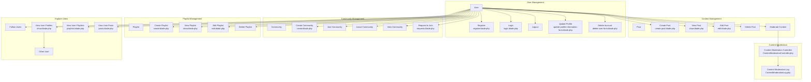

# Codebase Research Report

## Query
I want an use case diagram of my project

## Answer
### System Diagram



### Summary
It seems that the `text_search` is not providing useful results. I will try to infer the use cases directly from the directory structure and file names.

Based on the directory structure, here's a potential use case diagram:

```markdown
# CodeViz Use Case Diagram

## Use Cases

- **User Management:**
    - Register (file:resources/views/auth/register.blade.php)
    - Login (file:resources/views/auth/login.blade.php)
    - Logout
    - Update Profile (file:resources/views/profile/update-profile-information-form.blade.php)
    - Delete Account (file:resources/views/profile/delete-user-form.blade.php)
- **Community Management:**
    - Create Community (file:resources/views/communities/create.blade.php)
    - Join Community
    - Leave Community
    - View Community
    - Request to Join Community (file:resources/views/communities/requests.blade.php)
- **Playlist Management:**
    - Create Playlist (file:resources/views/playlists/create.blade.php)
    - View Playlist (file:resources/views/playlists/show.blade.php)
    - Edit Playlist (file:resources/views/playlists/edit.blade.php)
    - Delete Playlist
- **Content Management:**
    - Create Post (file:resources/views/communities/create-post.blade.php)
    - View Post (file:resources/views/posts/show.blade.php)
    - Edit Post (file:resources/views/posts/edit.blade.php)
    - Delete Post
    - Moderate Content (file:app/Http/Controllers/ContentModerationController.php)
- **Content Moderation:**
    - Moderate Content (file:app/Http/Controllers/ContentModerationController.php)
    - View Moderation Logs (file:app/Models/ContentModerationLog.php)
- **Explore Users:**
    - Follow Users
    - View User Profiles (file:resources/views/explore/users/show.blade.php)
    - View User Playlists (file:resources/views/explore/users/partials/playlists.blade.php)
    - View User Posts (file:resources/views/explore/users/partials/posts.blade.php)
```

## Walkthrough Steps

### 1. CodeViz Use Case Diagram Overview
This diagram outlines the primary use cases for the CodeViz application, inferred from the project's directory structure and file names. It provides a high-level overview of user interactions and functionalities within the system. The use cases are grouped into several key areas: User Management, Community Management, Playlist Management, Content Management, Content Moderation, and Explore Users.

### 2. User Management Use Cases
The `User Management` use case covers functionalities related to user accounts. Users can `Register` using the `register.blade.php` view, `Login` using the `login.blade.php` view, `Logout`, `Update Profile` using the `update-profile-information-form.blade.php` view, and `Delete Account` using the `delete-user-form.blade.php` view.

### 3. Community Management Use Cases
The `Community Management` use case focuses on community-related actions. Users can `Create Community` using the `create.blade.php` view, `Join Community`, `Leave Community`, `View Community`, and `Request to Join Community` using the `requests.blade.php` view.

### 4. Playlist Management Use Cases
The `Playlist Management` use case handles playlist functionalities. Users can `Create Playlist` using the `create.blade.php` view, `View Playlist` using the `show.blade.php` view, `Edit Playlist` using the `edit.blade.php` view, and `Delete Playlist`.

### 5. Content Management Use Cases
The `Content Management` use case deals with content creation and modification. Users can `Create Post` using the `create-post.blade.php` view, `View Post` using the `show.blade.php` view, `Edit Post` using the `edit.blade.php` view, and `Delete Post`. Additionally, there is a `Moderate Content` function.

### 6. Content Moderation Use Cases
The `Content Moderation` use case is responsible for managing content moderation activities. It includes `Moderate Content` handled by the `ContentModerationController.php` controller and `View Moderation Logs` using the `ContentModerationLog.php` model.

### 7. Explore Users Use Cases
The `Explore Users` use case allows users to discover and interact with other users. Users can `Follow Users`, `View User Profiles` using the `show.blade.php` view, `View User Playlists` using the `playlists.blade.php` partial view, and `View User Posts` using the `posts.blade.php` partial view.

---
*Generated by [CodeViz.ai](https://codeviz.ai) on 12/6/2025, 23:00:54*
